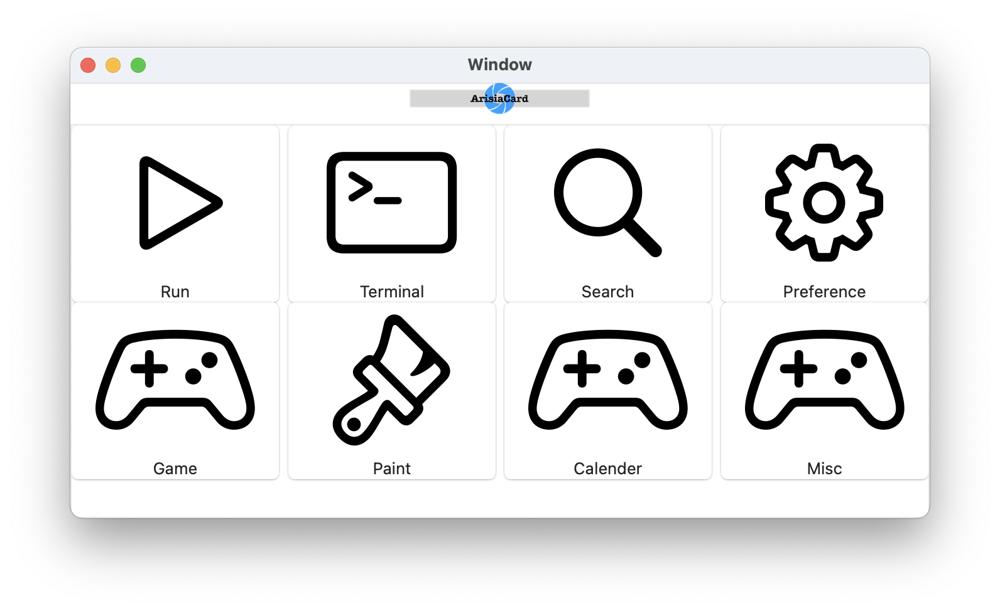
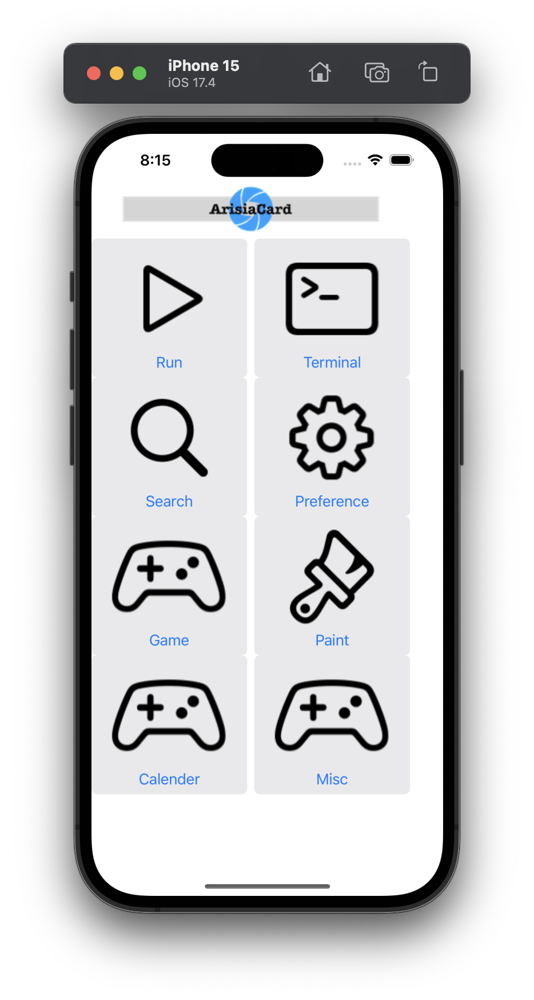

# ArisiaCard

## Introduction
The *ArisiaCard* is the rapid application development based on the [Arisia Platform](../README.md) archtecture.

## Download
To develop the application on the ArisiaCard, you need some command line applications.
You can download them from following pages:
* [Download ArisiaTool](../ArisiaTools/README.md): Command line applications to develop the Arisia application.

These applications are *not distributed* with the ArisiaCard applicationc because Apple does not allow to distribute the command line application from the MacAppStore.

## Screen shot

### Welcome page for macOS

### Welcome page for iOS

# Related links
* [Steel Wheels Project](https://github.com/steelwheels): The owner of this software.
* [Arisia Platform](https://github.com/steelwheels/Arisia#readme): Main document for Arisia Platform.
