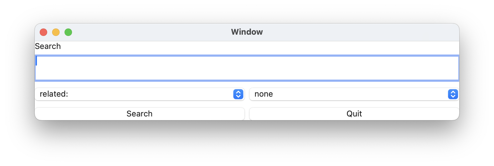

# Search application
The search application helps you to search operation with search options.

## Implementation
You can find the source code of this application at 
[Search.jspkg](https://gitlab.com/steewheels/arisia/-/tree/main/ArisiaCard/Resource/Search.jspkg).

## Reference
* [Google Search Operators: The Complete List](https://ahrefs.com/blog/google-advanced-search-operators/) : The expression which can be used by google search

# Related links
* [Arisia Platform](https://gitlab.com/steewheels/arisia/-/blob/main/README.md)
* [Kiwi Library](https://gitlab.com/steewheels/kiwiscript/-/blob/main/KiwiLibrary/Document/Library.md)
* [Steel Wheels Project](https://gitlab.com/steewheels/project/-/blob/main/README.md)

