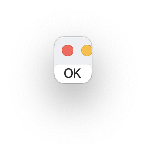

# `Button` component

## Introduction
A control that defines an area on the screen that a user clicks to trigger an action.

## Interface

This is the interface definition for TypeScript:
<pre>
interface ButtonIF extends FrameIF {
  pressed(p0 : ButtonIF): void ;
  isEnabled : boolean ;
  title : string ;
}
declare function _alloc_Button(): ButtonIF ;

</pre>

## Example
<pre>
{
  ok_button: Button {
        title: string "OK"
        pressed: event() %{
	    	leaveView(0) ;
        %}
  }
}

</pre>

# Related links
* [Arisia Platform](https://gitlab.com/steewheels/arisia/-/blob/main/README.md)
* [Kiwi Library](https://gitlab.com/steewheels/kiwiscript/-/blob/main/KiwiLibrary/Document/Library.md)
* [Steel Wheels Project](https://gitlab.com/steewheels/project/-/blob/main/README.md)

