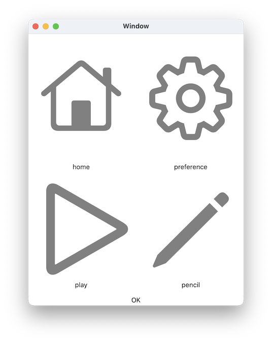
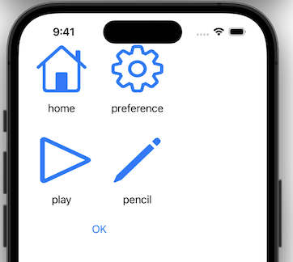

# `IconView` component

## Introduction
Clickable IconView.

This is sample view of IconView:
(The "OK" button is NOT an icon component.)

## Interface

This is the interface definition for TypeScript:
<pre>
interface IconViewIF extends FrameIF {
  pressed(p0 : FrameIF): void ;
  symbol : string ;
  title : string ;
}
declare function _alloc_IconView(): IconViewIF ;

</pre>

## Sample Views and Script
### For macOS

### For iOS

### Sample script
<pre>
{
	homeIcon: IconView {
		symbol: string "house"
		title:  string "home"
		pressed: event() %{
			console.log("home") ;
		%}
	}
	ok_button: Button {
		title: string "OK"
        pressed: event() %{
	    	leaveView(0) ;
        %}
	}
}

</pre>

# Related links
* [Arisia Platform](https://gitlab.com/steewheels/arisia/-/blob/main/README.md)
* [Kiwi Library](https://gitlab.com/steewheels/kiwiscript/-/blob/main/KiwiLibrary/Document/Library.md)
* [Steel Wheels Project](https://gitlab.com/steewheels/project/-/blob/main/README.md)

