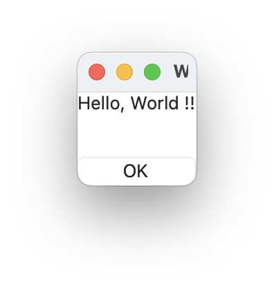

# `Label` component

## Introduction

For more details, see [label.jspkg](https://gitlab.com/steewheels/arisia/-/tree/main/ArisiaCard/Resource/Samples/label.jspkg).

## Interface

This is the interface definition for TypeScript:
<pre>
interface LabelIF extends FrameIF {
  text : string ;
  number : number ;
}
declare function _alloc_Label(): LabelIF ;

</pre>

Sample script
<pre>
{
  label: Label {
    text:   string     "Hello, World !!"
  }
  ok_button: Button {
        title: string "OK"
        pressed: event() %{
	    	leaveView(0) ;
        %}
  }
}

</pre>

# Related links
* [Arisia Platform](https://gitlab.com/steewheels/arisia/-/blob/main/README.md)
* [Kiwi Library](https://gitlab.com/steewheels/kiwiscript/-/blob/main/KiwiLibrary/Document/Library.md)
* [Steel Wheels Project](https://gitlab.com/steewheels/project/-/blob/main/README.md)

