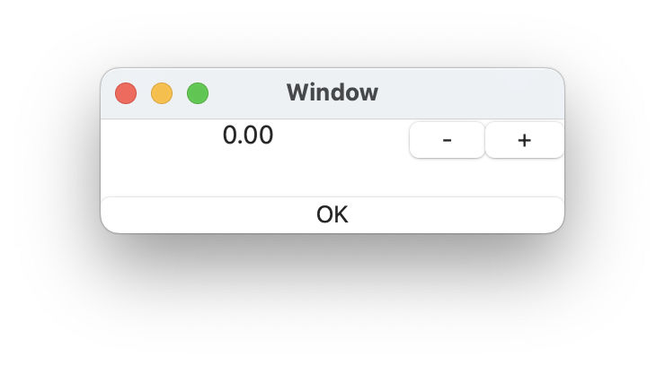

# `Stepper` component

## Introduction

## Interface

This is the interface definition for TypeScript:
<pre>
interface StepperIF extends FrameIF {
  initValue : number ;
  maxValue : number ;
  minValue : number ;
  stepValue : number ;
  updated(p0 : StepperIF, p1 : number): void ;
}
declare function _alloc_Stepper(): StepperIF ;

</pre>

## Example
<pre>
{
  stepper: Stepper {
    minValue:  number -10.0
    maxValue:  number  10.0
    stepValue: number   1.0
    initValue: number   0.0
    updated: event(val: number) %{
      console.log("current value: " + val) ;
    %}
  }
  ok_button: Button {
        title: string "OK"
        pressed: event() %{
	    	leaveView(0) ;
        %}
  }
}

</pre>

# Related links
* [Arisia Platform](https://gitlab.com/steewheels/arisia/-/blob/main/README.md)
* [Kiwi Library](https://gitlab.com/steewheels/kiwiscript/-/blob/main/KiwiLibrary/Document/Library.md)
* [Steel Wheels Project](https://gitlab.com/steewheels/project/-/blob/main/README.md)

