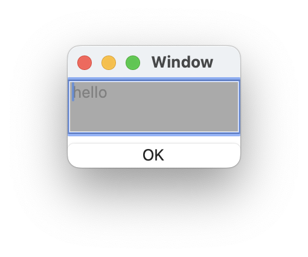

# `TextField` component

## Introduction
Text field

## Interface

This is the interface definition for TypeScript:
<pre>
interface TextFieldIF extends FrameIF {
  isEditable : boolean ;
  text : string ;
  number : number ;
  hasBackgroundColor : boolean ;
}
declare function _alloc_TextField(): TextFieldIF ;

</pre>

## Example
You can get the value of the text field by refering <code>text</code> property.
<pre>
{
	edit: TextField {
		isEditable: boolean true
		hasBackgroundColor: boolean true
		text: string "hello"
	}
	ok_button: Button {
		title: string "OK"
		pressed: event() %{
			console.log("textfield: " + root.edit.text) ;
			leaveView(0) ;
		%}
	}
}

</pre>

# Related links
* [Arisia Platform](https://gitlab.com/steewheels/arisia/-/blob/main/README.md)
* [Kiwi Library](https://gitlab.com/steewheels/kiwiscript/-/blob/main/KiwiLibrary/Document/Library.md)
* [Steel Wheels Project](https://gitlab.com/steewheels/project/-/blob/main/README.md)

