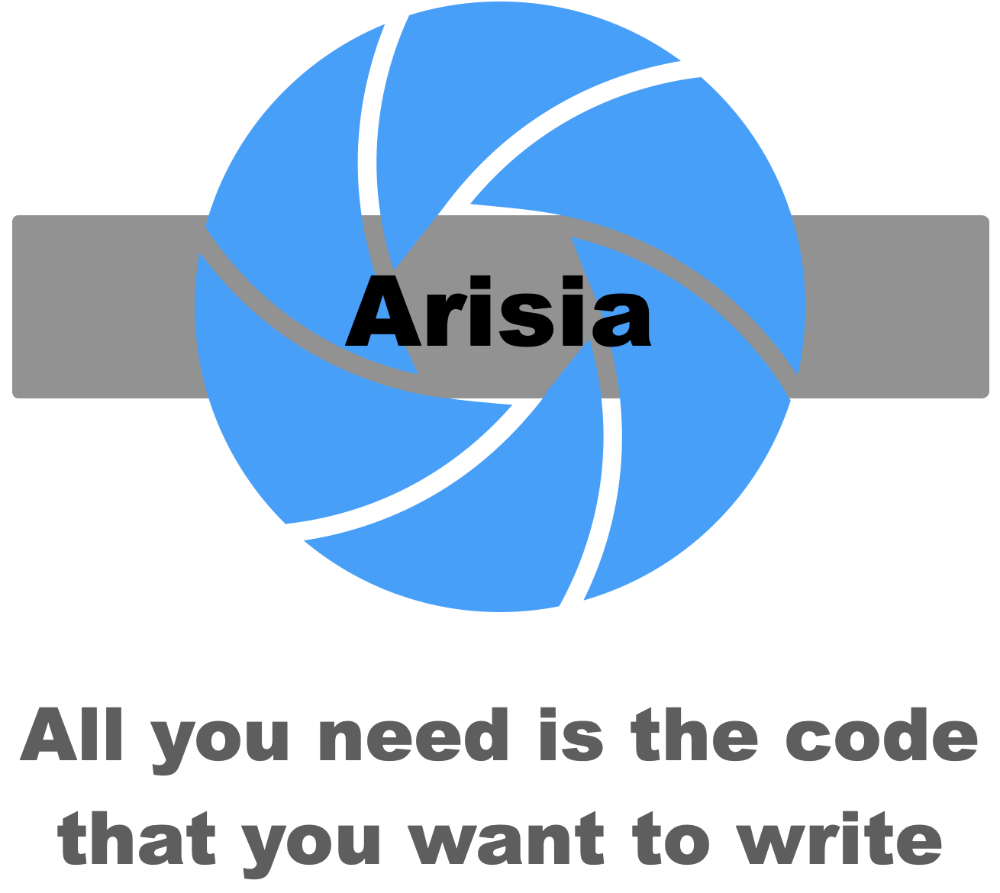
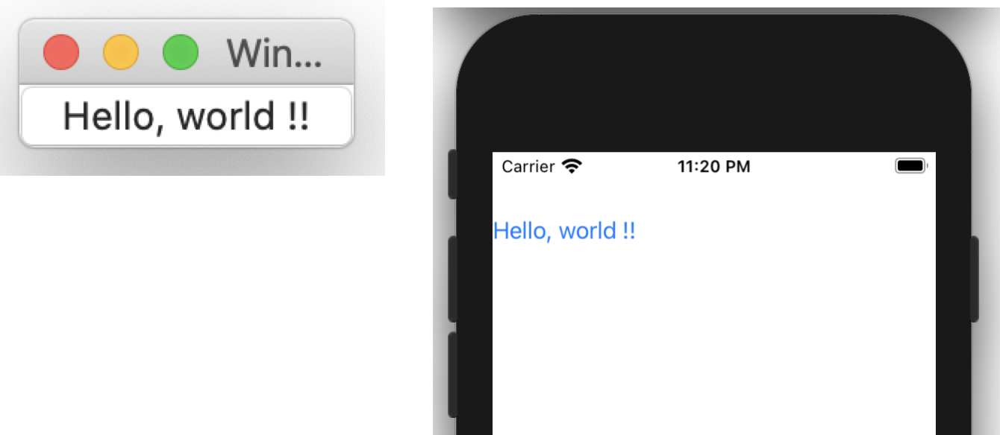

# Arisia Platform

<p align="center">

</p>

## Introduction
The *Arisia Platform* is the software platform for the rapid application software development.
The [ArisiaCard](./ArisiaCard/README.md) is an implementation of it.

For rapid application development, the following matters are required:
* The programming language that allows writing your ideas directory.
* Rich built-in components that eliminate the needs to reinvent the wheel
* Simple permanent data management and operation.
* The platform which supports multiple target OS and hardware

This platform has following features to meet these requirements:
* The [TypeScript](https://www.typescriptlang.org) is used to implement logics. And the [ArisiaScript](./Document/arisia-lang.md) is used to implement components such as GUI parts. The ArisiaScript is small extension of the TypeScript for event driven programming.
* Usual GUI parts are implemented as built-in components. See [component list](./Document/arisia-components.md).　And there are many built-in classes and functions. see [Arisia Library](./Document/arisia-library.md) and [Kiwi Library](https://gitlab.com/steewheels/kiwiscript/-/blob/main/KiwiLibrary/Document/Library.md?ref_type=heads).
* The *resource* system manages the permanent data. You can declare the table data type by TypeScript and define the (initial) data as JSON data. See [resource](./Document/resource.md) section.
* The application designed for Arisia Platform runs on [macOS](https://www.apple.com/macos/) and [iOS](https://www.apple.com/ios/). 

## Sample screen shot
This is a simple example of ArisiaScript program.
````
{
  button: Button {
    title: string "Hello, world !!"
    pressed: event() %{
      console.log("Pressed") ;
    %}
  }
}
````
There are sample screen shots which is executed on MacOS and iOS.

<p align="center">

</p>

## License
Copyright (C) 2014-2024 [Steel Wheels Project](https://gitlab.com/steewheels/project/-/blob/main/README.md).
This software is distributed under [GNU LESSER GENERAL PUBLIC LICENSE Version 2.1](https://www.gnu.org/licenses/lgpl-2.1-standalone.html) and the document is distributed under [GNU Free Documentation License](https://www.gnu.org/licenses/fdl-1.3.en.html).

## Target system
* OS version:   macOS 13, iOS 16
* Xcode:        Xcode 14

## Introduction
The [ArisiaCard](./ArisiaCard/README.md) application contains some sample applications to know what is Arisia application.
But if you want to develop your custom Arisia application, you have to download the command line tools. See the `installation` page.

* [Installation](./Document/install.md): How to build the application from the source code repository.
* [Application Development Flow](./Document/dev-flow.md): Development flow and tool chain.

## Applications
* [Terminal](./Document/Applications/terminal.md): JavaScript playground. You can type and execute the JavaScript interactively.
* [Search](./Document/Applications/search.md): This application helps you to search by google.
* [Battle Field Code](./Document/Games/BattleFieldCode.md): The tank battle that they are controlled by TypeScript codes.

## Documentations
* [ArisiaCard](./ArisiaCard/README.md): The implementation of Arisia Platform. 
* [ArisiaScript](./Document/arisia-lang.md): The language specification of *ArisiaScript*. 
* [ArisiaTools](./ArisiaTools/README.md): Command line tools for development 
* [component list](./Document/arisia-components.md): The list of built-in components. It supports GUI and database programming.
* [storage](./Document/arisia-storage.md): The data structure.
* [database](./Document/database.md): The database access support.
* [Arisia Library](./Document/arisia-library.md): The built-in functions to support Arisia Platform.
* [Kiwi Standard Library](https://gitlab.com/steewheels/kiwiscript/-/blob/main/KiwiLibrary/Document/Library.md): General purpose JavaScript (coded by TypeScript) library.
* [Manifest file](https://gitlab.com/steewheels/kiwiscript/-/blob/main/KiwiEngine/Document/manifest.md): The file to declare all resources for the application.
* Build config: [Document type](Config/document-type.md)

## Programming Tips
* [vim support](./Document/Tips/vim-support.md)

# Related links
* [Steel Wheels Project](https://gitlab.com/steewheels/project/-/blob/main/README.md): The developper of this product.
* Arisia: The name of the star in the novel [lensman](https://en.wikipedia.org/wiki/Lensman_series)

